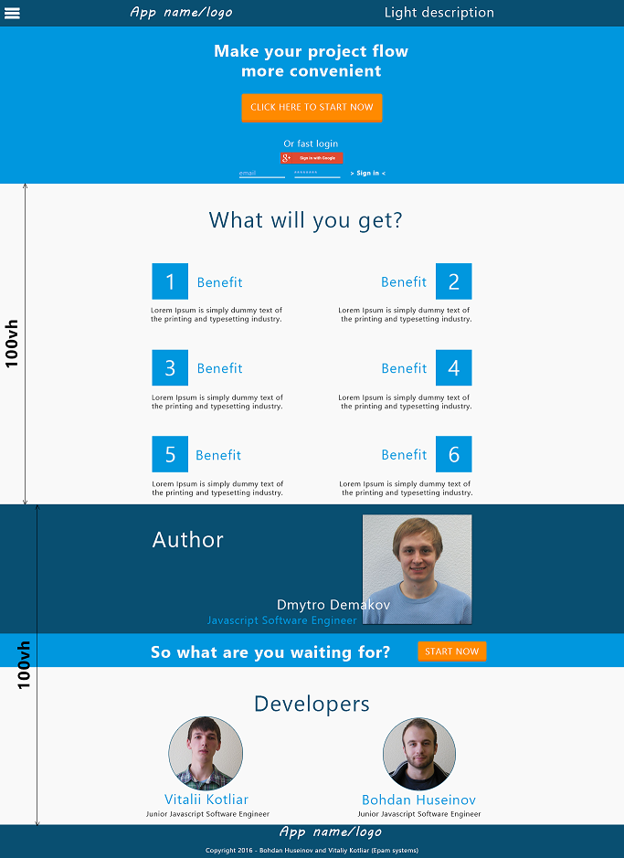
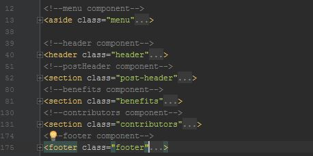
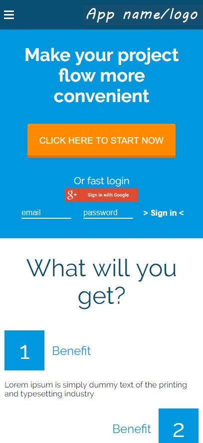
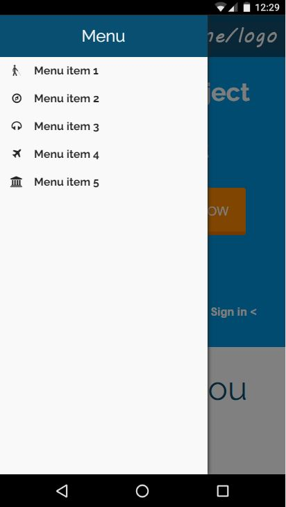

## JSMP3.7: HTML AND CSS MASTERSHIP + RESPONSIVE WEB DESIGN (Huseinov B.)
1. Первоначально был продуман и создан .psd макет в соответствии с нуждами будущего проекта


2. Далее была построена html разметка, разбитая по компонентам, где каждому html элементу присвоен класс в соответствии с методологией BEM


3. Далее по принципу mobile-first был произведен стайлинг всех компонентов поддерживая 3 медиа запроса:
```sh
$small: 360px;
$medium: 480px;
$high: 768px;
```



Так как мы используем препроцессор (scss) удобно было разделить файлы стилей на различные состовляющие. Получилось 4 файла: цвета, медиа запросы, миксины и сам файл стилей. Файл стилей был использован только один так как в дальнейшем будет использоваться фреймворк js , который будет делить части сайта на компоненты с помощью которого потом и будут разделены компоненты в этом файле стилей.
В качестве цветов были использованы 7 различных которые и применялись по всей страничке и будут применяться по всему сайту в будущем:
```sh
$dark-blue: #094f71;
$primary-blue: #0097de;
$light-black: #272727;
$primary-white: #f9f9f9;
$primary-orange: #ff8a00;
$dark-orange: #e97300;
$white-blue: #9fc2fd;
```

Среди миксинов продуманы несколько главных которые ресетят при необходимости стандартное поведение списков, кнопок, инпутов, ссылок.
*В качестве бонуса была добавлена некоторая анимация на страничке для более приятного использования и впечатления юзера.*